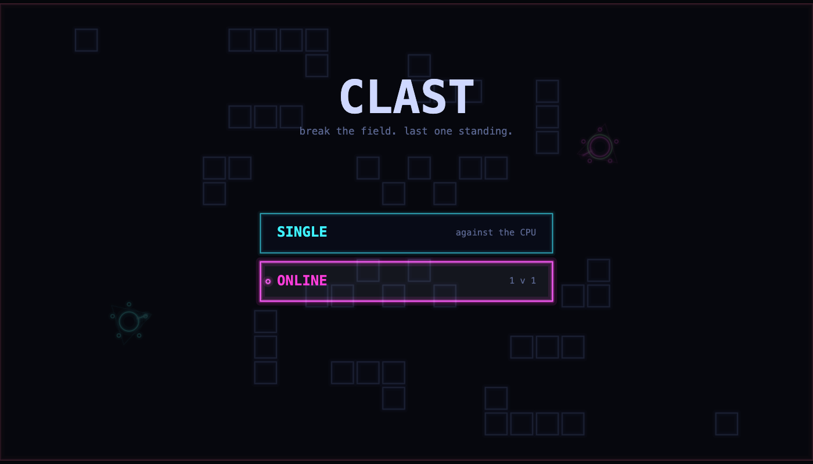
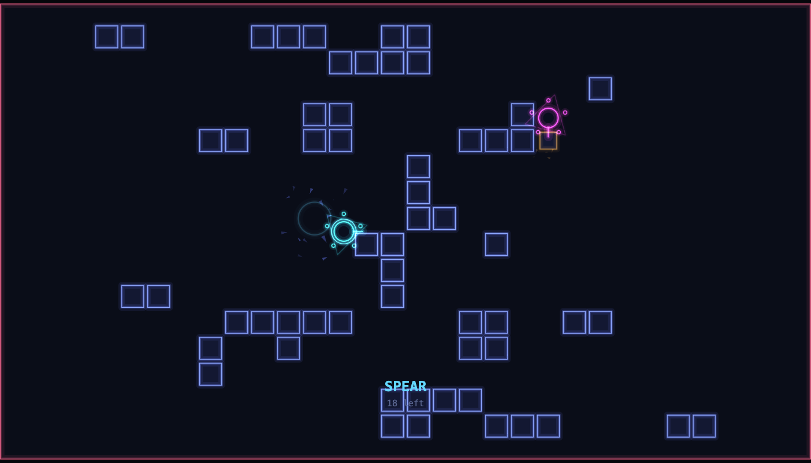
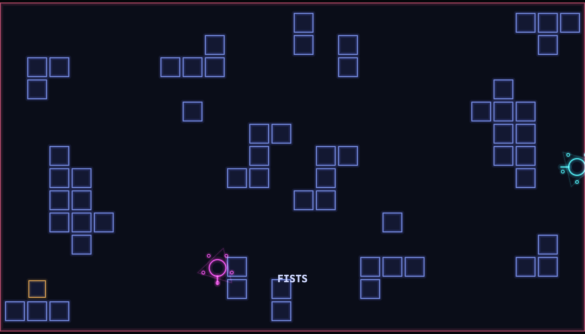
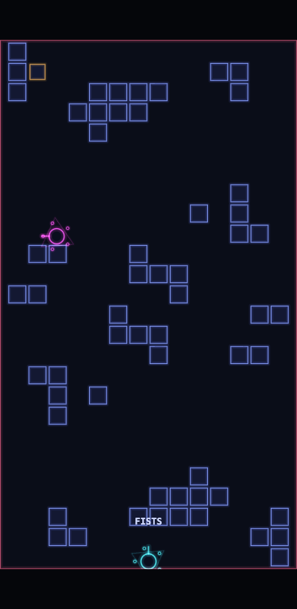
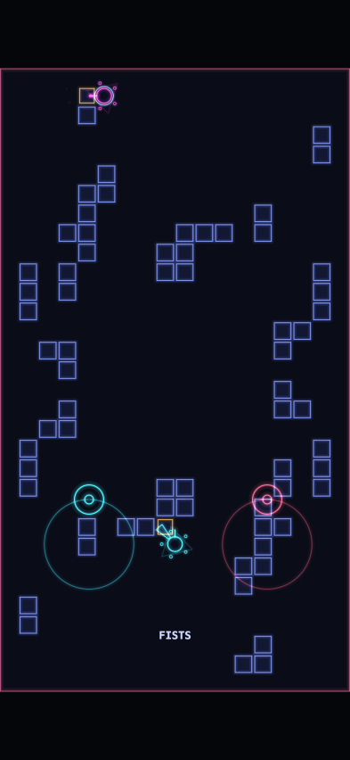

# Clast

A 1v1 top-down arena game that runs in a browser tab.

**[Play it →](https://clast.duckdns.org)**

Two fighters start on opposite sides of a field of breakable blocks. Every
piece of cover can be knocked down, weapons fall out of the rubble, and the
playable area zooms in on the centre until there is nowhere left to hide.
A match takes about twenty seconds.

No install, no account, no game server. Multiplayer is peer to peer, and the
whole thing is 42 KB gzipped, plus 43 KB for its font.





*A clast is a fragment broken off a larger rock, which is most of what happens
here.*

## Controls

|                  | Move       | Aim         | Attack                            |
| ---------------- | ---------- | ----------- | --------------------------------- |
| Keyboard & mouse | `WASD`     | mouse       | click or `space`                  |
| Touch            | left thumb | where you walk | right thumb — tap, or hold to keep swinging |
| Gamepad          | left stick | right stick | `A` / right trigger, or shove the right stick |

Menus take arrow keys, the D-pad or either stick, with `enter`/`A` to choose
and `esc`/`B` to go back. `F3` toggles a debug overlay.

Blocks have 3 health and your fists do 1 damage, so bare-handed you are
chipping away. Breaking a block has a 28% chance of dropping one of five
weapons — a little more when you are hurt, up to 40% on your last point of
health: a fast **dagger**, a long-reach **spear**, a **hammer** that clears a
block per swing, a thrown **shard**, and a **bomb** whose blast rewrites the
cover around it. Weapons have limited charges and you fall back to fists when
they run out.

## One arena, two orientations

This is the part worth explaining.

The world is always the same canonical **1280×720 rectangle**. Orientation and
which side you are on are purely local decisions: every client applies its own
rotation when it draws.

|            | Landscape | Portrait |
| ---------- | --------- | -------- |
| **Seat 0** | 0°        | 270°     |
| **Seat 1** | 180°      | 90°      |

Two things fall out of that table, and both are the point:

- Your own spawn is always at **screen-left** in landscape and **screen-bottom**
  in portrait, with your opponent opposite you, on every client.
- An odd number of quarter turns swaps the axes, so the same 16:9 world fills a
  9:16 letterbox *exactly*. A phone held upright and a desktop window show an
  identical arena, differing only by rotation.

| Landscape, seat 1 (180°)              | Portrait, seat 0 (270°)             |
| ------------------------------------- | ----------------------------------- |
|  |  |

The same live match, at the same instant, from the two ends of a WebRTC
connection. Rotate either image a quarter turn and it becomes the other.

Input runs back through the inverse of the same transform, which is what makes
"forward" the same gesture for everybody: pushing up on a phone and pressing
`W` on a desktop both resolve to *toward the opponent*, whichever seat you
drew. Nothing below the renderer knows that portrait exists.

The letterbox is the other half of that promise. The playfield is identical at
every window size; anything outside the 16:9 or 9:16 frame is a black bar.

## Mobile

Hold the phone either way: upright gets the portrait view, sideways the
landscape one, and it switches the moment you turn it. The left half is a floating stick — wherever your thumb lands becomes the
centre, so you never have to look down to find it. The right half is one big
attack button: you swing toward wherever you last walked, so only one thumb
ever has to steer.



It is also a PWA: *Add to Home Screen* installs it full screen with no browser
chrome, and a small service worker keeps it playable offline against the CPU.
The page is fetched network-first so a deploy shows up on the next launch;
the hashed assets are cache-first.

## Multiplayer

Peer to peer over WebRTC, using [Trystero](https://github.com/dmotz/trystero)
for discovery. Public nostr relays carry nothing but the connection handshake;
once two players are connected, every byte of the match travels directly
between them. There is no game server and nothing to deploy beyond static
files.

Two ways in:

- **Quick match** — join the lobby and pair with whoever is waiting.
- **Room code** — five characters from an alphabet with no `0`/`O` or `1`/`I`,
  because people read these aloud. Share it and your friend types it in.

One peer hosts, decided by comparing peer ids so both sides reach the same
answer with nothing to negotiate. The host runs the only real simulation and
ships snapshots at 20 Hz. The guest predicts its own movement, replays the
inputs the host has not acknowledged yet when a snapshot lands, and
interpolates the opponent one snapshot behind. The arena travels as deltas with
a full keyframe every two seconds, so a lost message cannot leave a phantom
wall standing on one screen.

## Single player

The CPU is an A\* pathfinder that prices destructible blocks rather than
treating them as walls, so a single search answers both "walk around it" and
"smash through it" — and when the next step of its path is still solid, it
attacks instead of walking.

It mines cover for weapons when nobody is in reach, holds whatever range its
current weapon wants (but only while it has line of sight), sidesteps thrown
shards, and backs off when it is losing — briefly, and only while actually
behind on health. Three difficulties, varying reaction delay, aim wobble,
planning rate and nerve.

## Running it

```sh
npm install
npm run dev      # vite, also served on your LAN for phone testing
npm test         # 84 tests, no browser needed
npm run build    # static output in dist/
npm run check    # typecheck only
```

Needs Node 22.6 or newer — the tests run TypeScript through Node's native type
stripping rather than a build step.

Pushing to `main` builds, tests and publishes to GitHub Pages.

## Layout

```
src/
  core/    fixed-timestep loop, seeded PRNG, vector maths
  game/    simulation, arena generation, weapons, A* over the grid
  input/   keyboard, pointer, touch sticks, gamepad, the CPU
  net/     wire protocol, host/guest sessions, lobby, pairing handshake
  ui/      menus, on-screen controls
  view/    viewport transforms, renderer, neon drawing, particles
```

Two boundaries do most of the architectural work:

- **`Sim` is headless and deterministic.** Same seed plus same inputs gives the
  same result anywhere. It takes one `PlayerInput` per seat and knows nothing
  about where they came from, so the local player, the CPU and the network all
  fill the same slot.
- **The netcode only knows a `Link`.** Two `send`/`receive` methods. The real
  one wraps a WebRTC data channel; the tests wire a host and a guest together
  in one process over a loopback with simulated latency.

## Tests

84 tests, none of which need a browser. They exist for the parts that fail
*quietly* — where the bug does not throw, it just makes the game subtly wrong
for one player:

- **View transforms.** A sign error here produces a game that looks perfect on
  your screen and is unplayable on your opponent's.
- **Arena symmetry.** The layout is point-symmetric so neither seat gets better
  cover. If that breaks, two people play different maps and each one's screen
  looks fine.
- **Collision**, including the case where a player sits exactly on the seam
  between two stacked cells — which used to let you walk through solid wall.
- **Determinism**, for the simulation and the loot stream, because peers that
  disagree about what fell out of a block are playing different games.
- **Netcode**, host against guest across simulated latency, jitter and
  reordering.
- **The pairing handshake under contention**, with whole queues of peers played
  out in memory. Three people arriving at once is where a naive
  offer/accept protocol leaves somebody talking to nobody.

## Built with

Vanilla TypeScript and Canvas 2D. No game engine, no framework, no renderer
library. Vite for the build, Trystero for peer discovery, and
[JetBrains Mono](https://www.jetbrains.com/lp/mono/) (OFL) as the one typeface,
bundled so every OS draws the same text.
